# Curracloe Chronicles
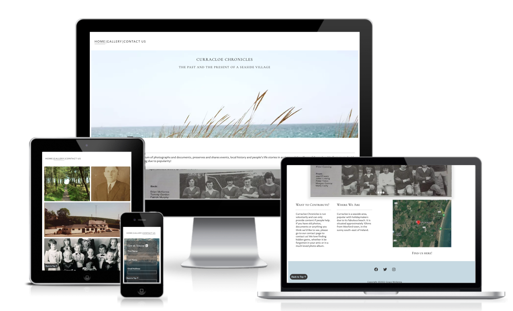

[Live Website - Curracloe Chronicles](https://gracemcken.github.io/PP1-CC/index.html "Live Website - Curracloe Chronicles")

# Site Overview
Curracloe Chronicles is a website that serves as a hub of information about the village of Curracloe in County Wexford, Ireland. Initially just a Facebook page, it was set up in the hope of preserving our local history and sharing memories among the community. This site is aimed at locals, tourists, and also people who have emigrated away who just miss home. This website was created as part of my Portfolio Project 1 with the Code Institute, for a Full Stack Software Developer diploma.
# Table of Contents
* [Technologies Used](#technologies-used)
* [Features](#features)
    * [Existing Features](#existing-features)
    * [Future Features](#future-features)
* [Design](#design) 
    * [User Stories](#user-stories)
    * [Wireframes](#wireframes)
    * [Typography](#typography)
    * [Images](#images)
    * [Colour Scheme](#colour-scheme)
* [Testing](#testing)
    * [Validator Testing](#validator-testing)
    * [Bugs](#bugs)  
* [Credits](#credits)  

## Technologies Used

 *  
 HTML was used to construct the base of our website and structure.
  

 *  
 CSS was used to style my website and make it responsive. Using just CSS and HTML I created a slider gallery and gallery page.
  

 * 
 I used Google Fonts to import some fonts that I wanted to use on my website to make it look more visually appealing.
  

 * 
 I used Balsamiq to make a mock up of my site in mobile, tablet and desktop form.
 

[Go to TOP](#table-of-contents)
     
## Features

### Existing Features
- __Navigation Bar__
    - The fully responsive navigation bar is featured in the upper left hand side of the website on each page, including Home, Gallery and Contact Us.
    - The current page you are on is underlined in the navigation bar, helping the user understand which part of the website they're on.
    - The access to each page in the navigation bar means using the back and forwards button on the user's browser is unneeded. 

    

    - The nav bar is repeated in the footer to make sure navigation is always accessible. 

    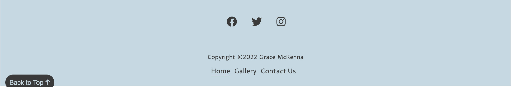

- __Hero Image__
    - The hero image is of an eye catching sand dune and sky, that stays fixed as you scroll.
    - It includes two headings to describe to name and summary of what the website entails.

    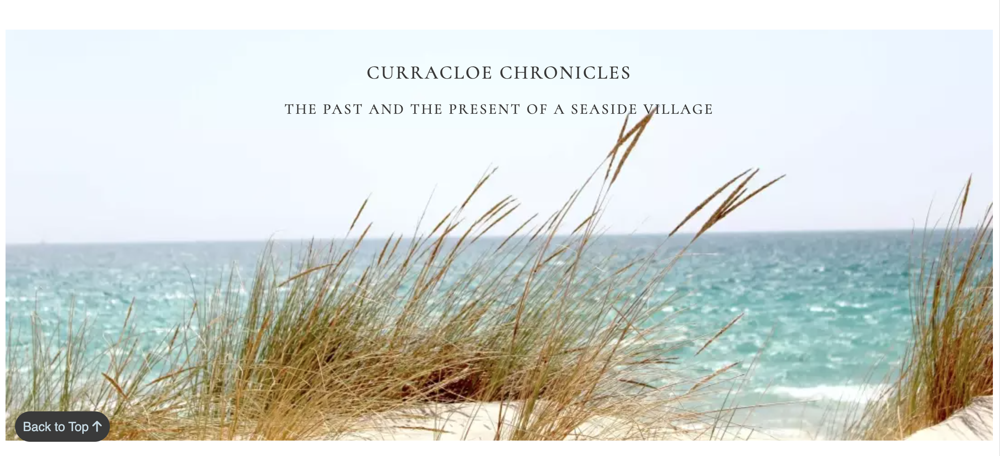   

- __Back to Top Button__
    - In the bottom left-hand corner of the screen there is a 'back-to-top' button. When clicked it will transport the user back to the beginning of the page. 
    - This button is static on the page, regardless of how much you scroll so it is always accessible. 
    - This was created with just CSS and HTML.

    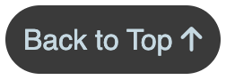   
      

- __Slider__
    - On the home page there is a short gallery slider showcasing a few of the images belonging to the website, giving the user a brief idea of what to expect in the full gallery.
    - This was created using just HTML and CSS as well. Resources used for this are linked in the [credits](#credits) section.

     

    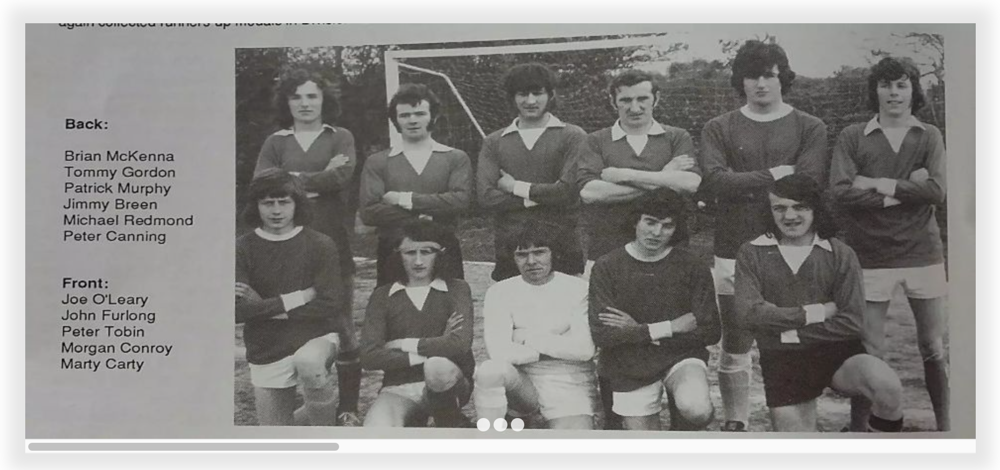
     

- __Map__
    - To show where Curracloe is located, I've included a still image of it's location on google maps.

    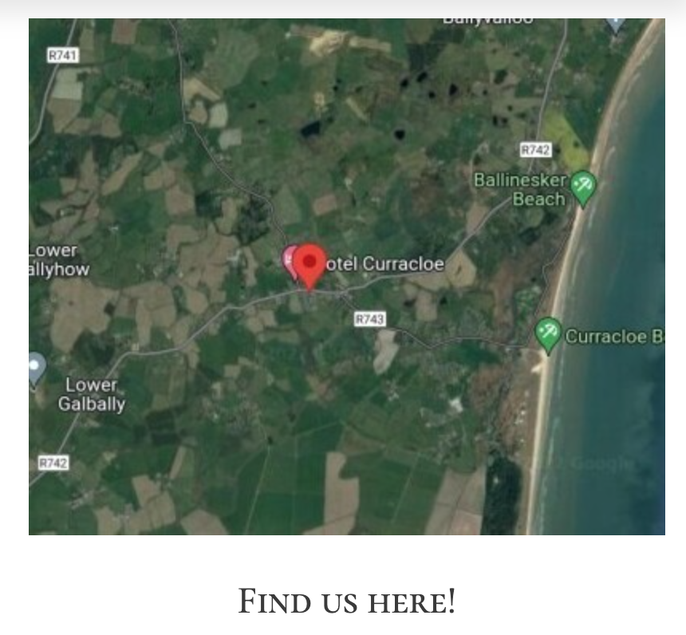
     

- __Social media links__
    - In the footer, along with the copyright, I have also included links to social medias.

    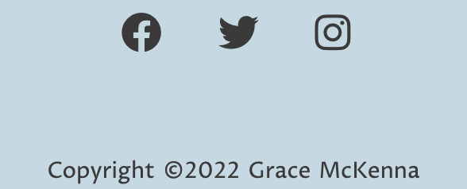  
     

- __Gallery__
    - On the Gallery page, I have created a small selection of images, that when hovered over on desktop, show relevent information.
    - On hand held devices, the information is shown when the images are tapped.

    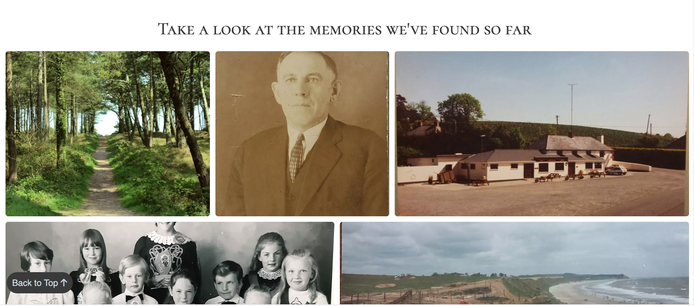
     
    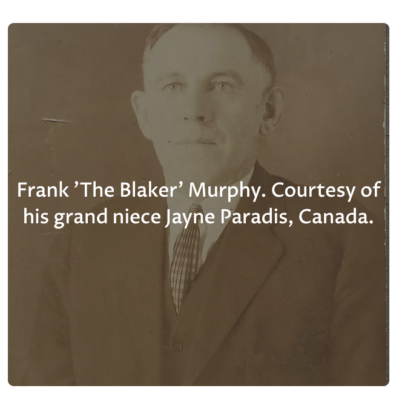
     

- __Contact Form__
    -  On the Contact Us page, there is a contact form in which you can input your first and last name, your email and your message to the website. 

    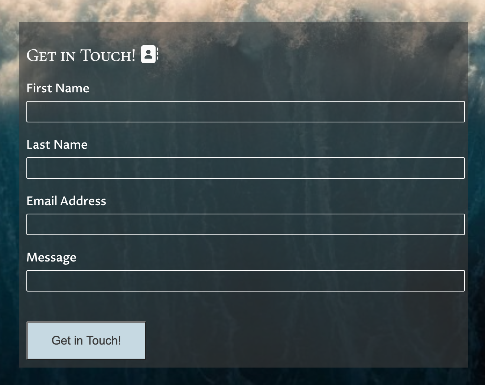
     
    
    - If you sucessfully fill out the form with your name, email and message, you will be redirected to a page that shows that the code works. 
    - This is not how I would like the user to be redirected in the final version of the website, but for the sake of this project I have left it as is.

    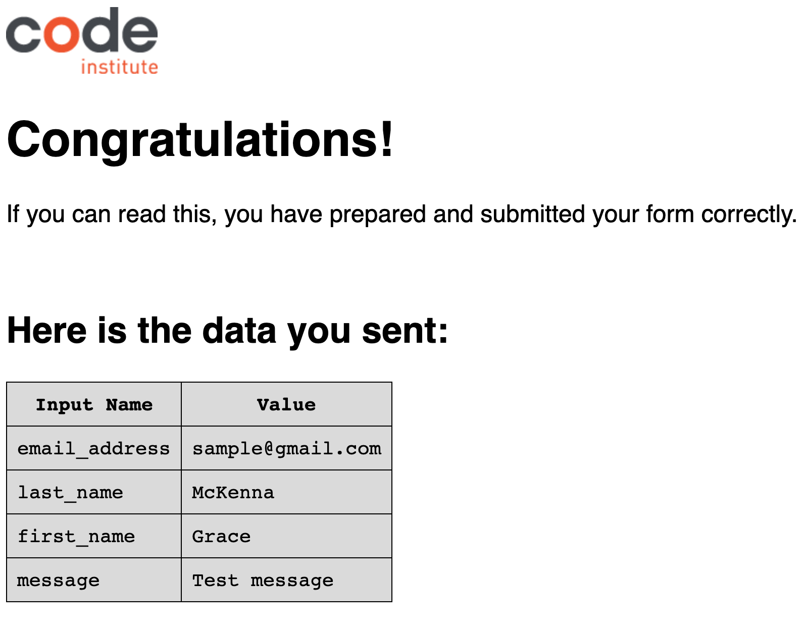
     
[Go to TOP](#table-of-contents)

### Future Features
- I would like to create a thank you page for the user to be redirected to once they complete the contact form in the future. I hope to do this once I learn beyond HTML and CSS.
- I would also like to add the ability to upload images or documents through the contact page, allowing people to submit items for the website to feature. Again, I believe this is something I may be able to do once I progress through the course and extend my knowledge.
- I would like to find a way to embed Google Maps into my page without getting errors with lighthouse testing. I'm not sure if this is something I can accomplish with more knowledge and time, but it is something I would like to look into for the future.

[Go to TOP](#table-of-contents)

## Design

### Wireframes
I used Balsamiq to construct my wireframes for this project. These are my initial rough ideas and don't necessarily reflect the finished website.
 - __Desktop__

 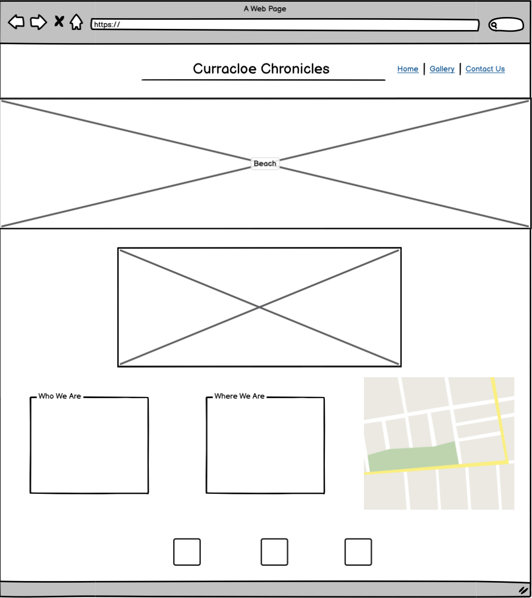
  

 - __Tablet__

 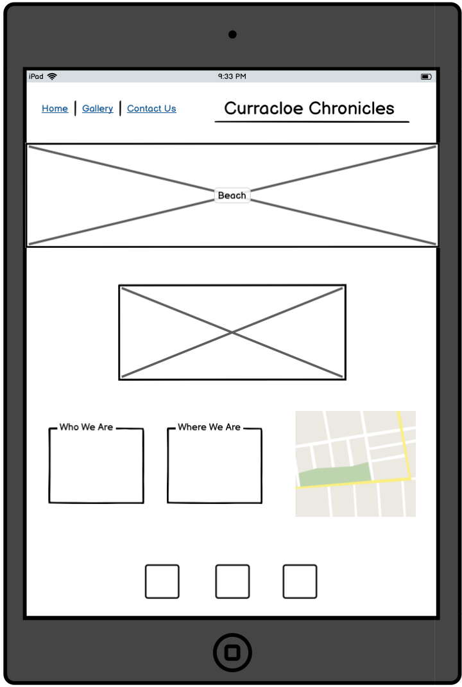

 

- __Mobile__

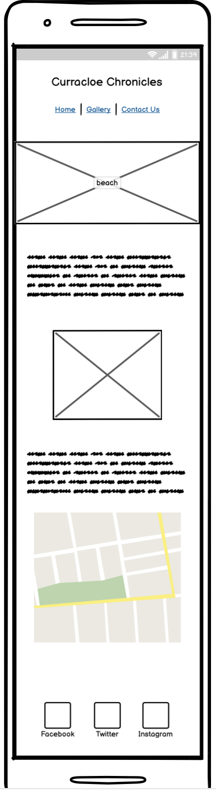

[Go to TOP](#table-of-contents)

### Typography
- For my main body text I used 'Proza Libre', a sans-serif font. I felt this font was simplistic enough to not take away from the imagery used, but was also stylishly minimalistic.
- For my headings, I used 'Cormorant SC', a serif font. I thought this font demanded attention without being too bold. It gives a sophisticated and historical feel to the website.
- Both fonts were imported from Google Fonts.

[Go to TOP](#table-of-contents)

### Images
I wanted to keep in the theme of the sand and ocean for my imagery, which is what Curracloe is well known for.
Both the hero image and contact form background image were taken from [pexels.com](pexels.com). All other images are from the [Curracloe Chronicles](https://www.facebook.com/Curracloe-Chronicles-2018719595076559) facebook page, which I admin and my father owns. Some of these images come from locals, and some of the scenic photos were taken by myself or my father.

[Go to TOP](#table-of-contents)

### Colour Scheme
- When choosing the colour scheme, I wanted to keep with the ocean and sand theme I had with my images. 
- Using [Coolors](https://www.coolors.co/) I created a colour palette that worked with my theme. 
- I ended up using these colours in my CSS to style the footer and buttons.

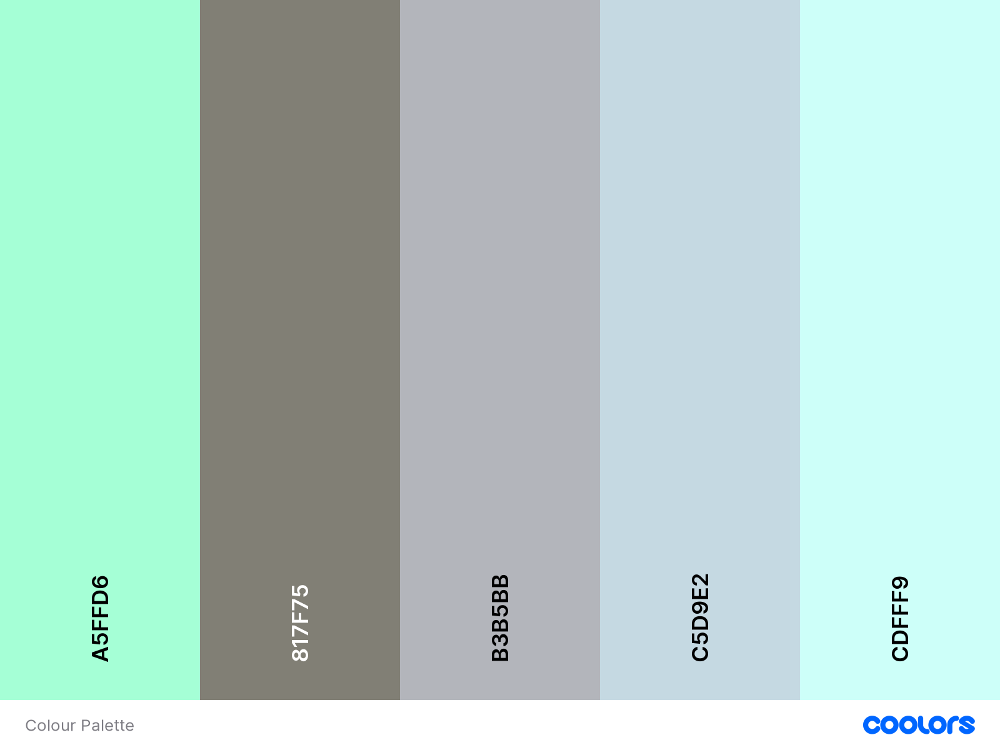

[Go to TOP](#table-of-contents)

## Testing

### Manual Testing
When initially put through Lighthouse, performance was continuously on a lower score. In an attempt to fix this, I hosted my images on cloudinary and used that as my image source. However this seemed to decrease performance even further on my index page and created an issue with cookies in the best practices score, which the site had been scoring 100 on previously. In the end with the help of my mentor, I was able to resize my images and hosted them once again directly from gitpod instead of cloudinary.

### Lighthouse Testing

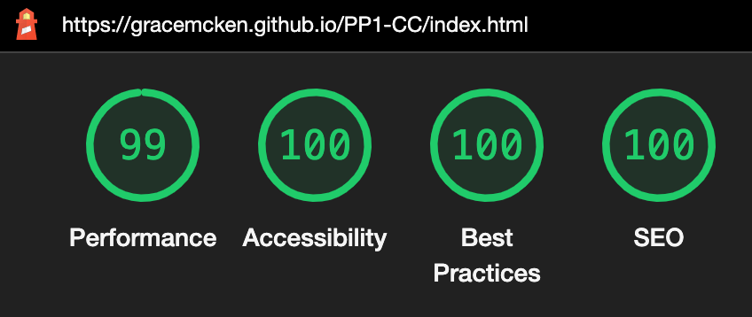

[Go to TOP](#table-of-contents)

### Validator Testing

- __Index Page__

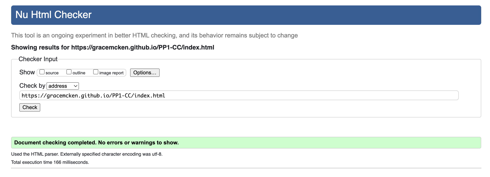

- __Gallery Page__

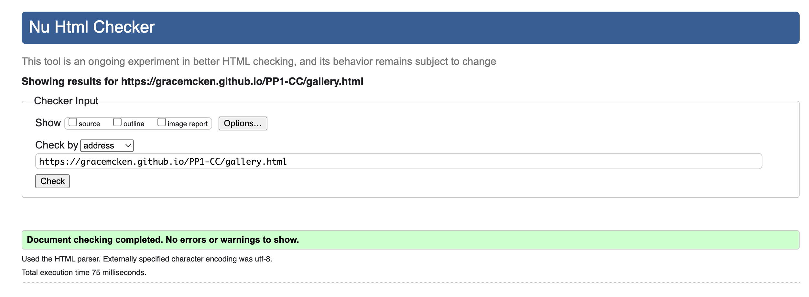

- __Contact Page__

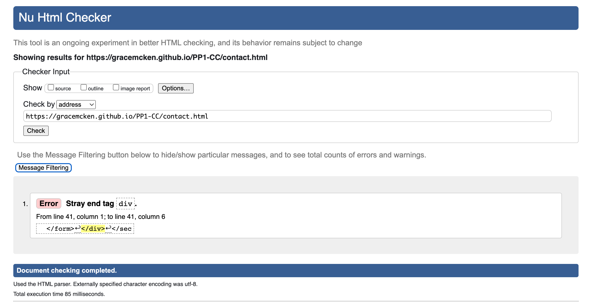

 
The intial check of the Contact page showed up one error of a stray div tag. Once I located it, I ran it through the validator again.

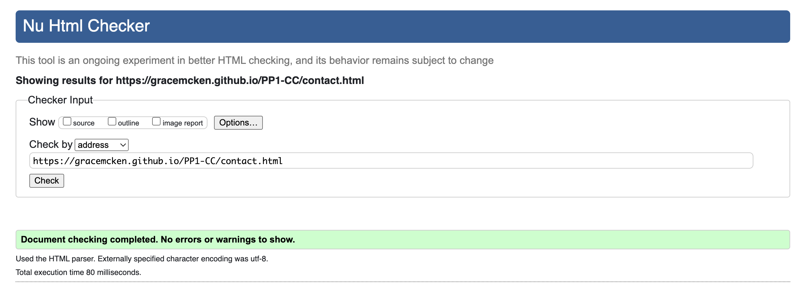

- __CSS__

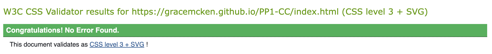

Although my CSS file passed with no errors, I did get two warnings as shown below:

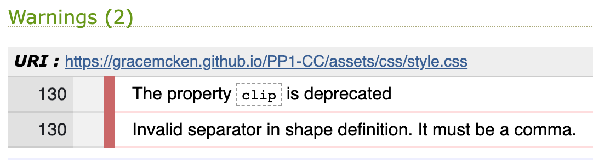

I went back into my CSS, identified and fixed the issue by changing `clip` to `clip path` and the value to `none`.

[Go to TOP](#table-of-contents)

### Bugs

- A major bug I encountered was with my contact page, where there was a large white section below my footer appearing when testing for several devices. See below:

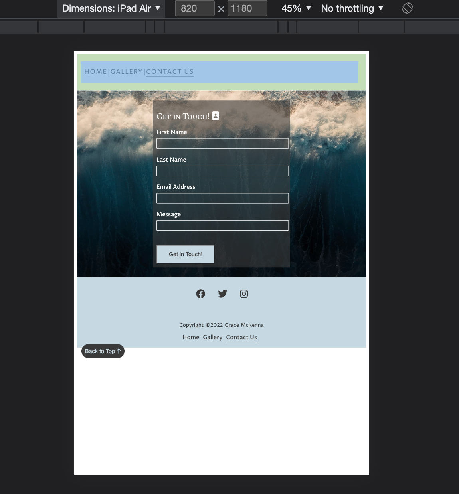

I fixed this by changing the form section height to 100vh, which was suggested by fellow students on Slack.

[Go to TOP](#table-of-contents)

## Credits
- Instructions on how to add vertical lines between menu items were found [here on Stack Overflow](https://stackoverflow.com/questions/31140935/how-do-i-add-vertical-line-on-my-menu-item-in-html-css).
- Idea for responsive hero image code came from [here](https://codepen.io/njericooper/pen/NVRQLe)
- I referenced [this](https://coder-coder.com/build-flexbox-website-layout/) to learn how to use flexbox to make a website responsive.
- I referenced [this](https://markus.oberlehner.net/blog/super-simple-progressively-enhanced-carousel-with-css-scroll-snap/) tutorial on how to make a slider with just HTML and CSS. This is featured on the home page.
- Idea for responsive gallery came from [here](https://blog.logrocket.com/how-create-responsive-image-gallery-css-flexbox/) 
- Idea for footer came from [here](https://www.foolishdeveloper.com/2021/09/responsive-footer-design.html)
