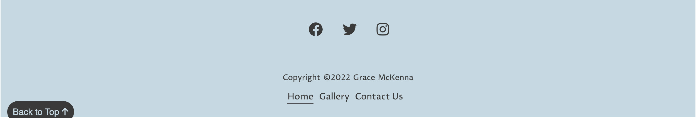
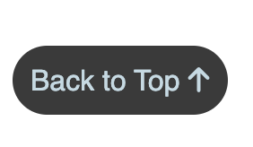
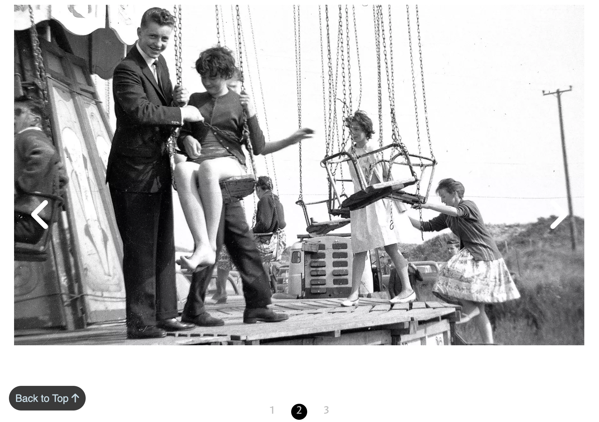
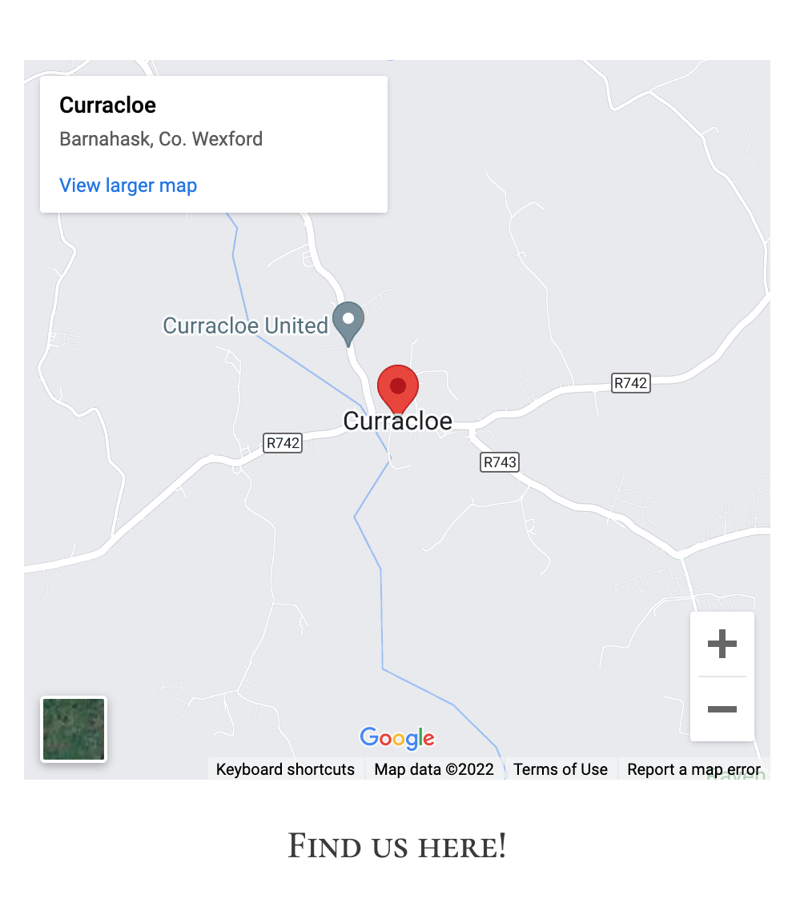
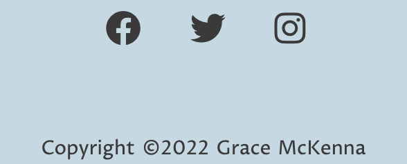
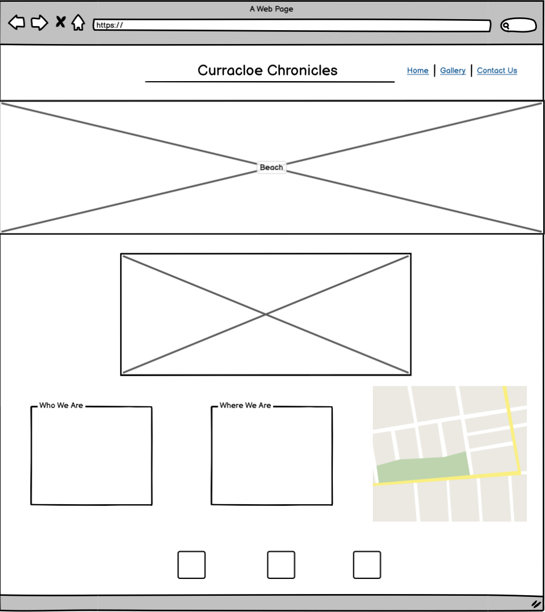
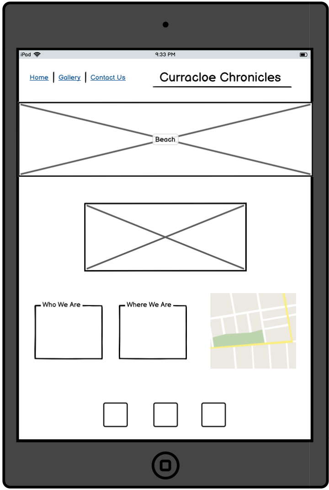
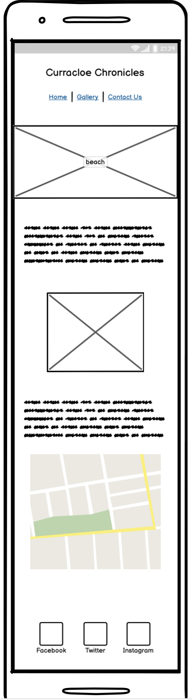
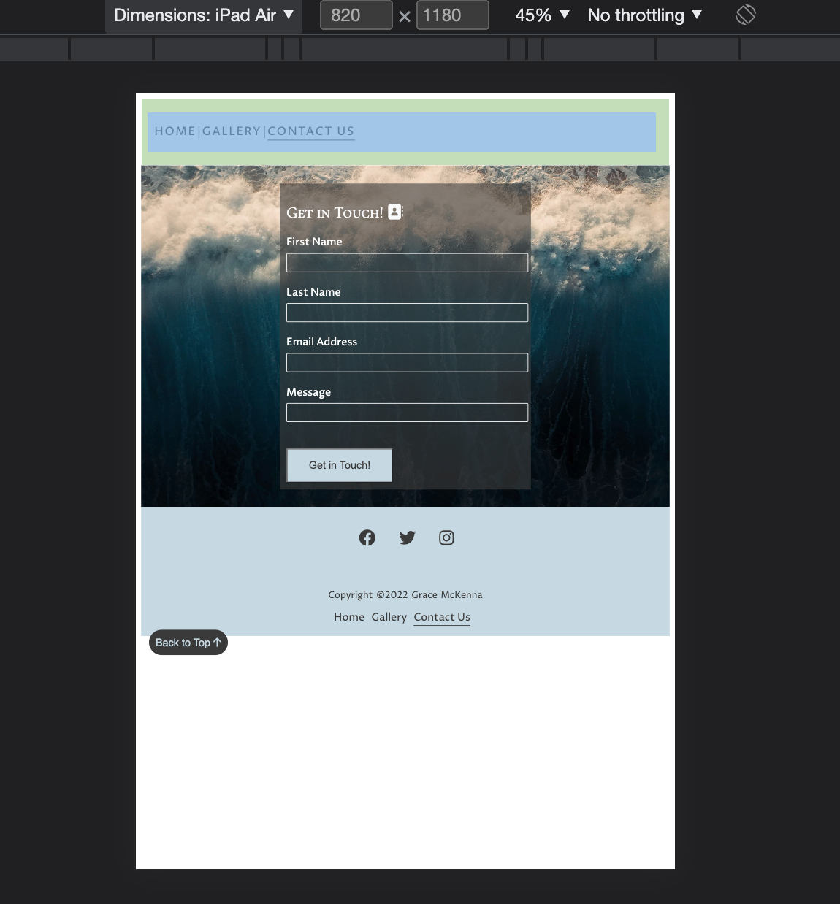

# Curracloe Chronicles
# Site Overview
Curracloe Chronicles is a website that serves as a hub of information about the village of Curracloe in County Wexford, Ireland. Initially just a Facebook page, it was set up in the hope of preserving our local history and sharing memories among the community. This site is aimed at locals, tourists, and also people who have emigrated away who just miss home. This website was created as part of my Portfolio Project 1 with the Code Institute, for a Full Stack Software Developer diploma.
# Table of Contents
* [Technologies Used](#technologies-used)
* [Features](#features)
    * [Existing Features](#existing-features)
    * [Future Features](#future-features)
* [Design](#design) 
    * [User Stories](#user-stories)
    * [Wireframe](#wireframe)
    * [Typography](#typography)
    * [Images](#images)
    * [Colour Scheme](#colour-scheme)
* [Testing](#testing)
    * [Validator Testing](#validator-testing)
    * [Bugs](#bugs)  
* [Credits](#credits)  

## Technologies Used

 *  
 HTML was used to construct the base of our website and structure.
  

 *  
 CSS was used to style my website and make it responsive. Using just CSS and HTML I created a slider gallery and gallery page.
  

 * 
 I used Google Fonts to import some fonts that I wanted to use on my website to make it look more visually appealing.
  

 * 
 I used Balsamiq to make a mock up of my site in mobile, tablet and desktop form.
 

[Got to TOP](#table-of-contents)
     
## Features

### Existing Features
- __Navigation Bar__
    - The fully responsive navigation bar is featured in the upper left hand side of the website on each page, including Home, Gallery and Contact Us.
    - The current page you are on is underlined in the navigation bar, helping the user understand which part of the website they're on.
    - The access to each page in the navigation bar means using the back and forwards button on the user's browser is unneeded. 

    

    - The nav bar is repeated in the footer to make sure navigation is always accessible. 

    

- __Back to Top Button__
    - In the bottom left-hand corner of the screen there is a 'back-to-top' button. When clicked it will transport the user back to the beginning of the page. This button is static on the page, regardless of how much you scroll so it is always accessible. This was created with just CSS and HTML.

       
      

- __Slider__
    - On the home page there is a short gallery slider showcasing a few of the images that can be seen in the main gallery page.
    - This was created using just HTML and CSS as well.

     

    
     

- __Map__
    - To show where Curracloe is located, I've included an iframe of Google Maps.

    
     

- __Social media links__
    - In the footer, along with the copyright, I have also included links to social medias.

        
    

### Future Features

## Design

### Wireframe

 - __Desktop__

 
  

 - __Tablet__

 

 

- __Mobile__

### Typography

### Images

### Colour Scheme

## Testing
When initially put through Lighthouse, performance was continuously on a lower score. In an attempt to fix this, I hosted my images on cloudinary and used that as my image source. However this seemed to decrease performance even further on my index page and created an issue with cookies in the best practices score, which the site had been scoring 100 on previously.

### Validator Testing

### Bugs

- A major bug I encountered was with my contact page, where there was a large white section below my footer appearing when testing for several devices. See below:

I fixed this by changing the form section height to 100vh, which was suggested by fellow students on Slack.

## Credits
- Instructions on how to add vertical lines between menu items were found [here on Stack Overflow](https://stackoverflow.com/questions/31140935/how-do-i-add-vertical-line-on-my-menu-item-in-html-css).
- Idea for responsive hero image code came from [here] (https://codepen.io/njericooper/pen/NVRQLe).
- I referenced [this](https://coder-coder.com/build-flexbox-website-layout/) to learn how to use flexbox to make a website responsive.
- I referenced [this](https://techmemorise.blogspot.com/2020/05/responsive-image-slider-with-buttons.html) tutorial on how to make a slider with just HTML and CSS. This is featured on the home page.
- Idea for responsive gallery came from [here](https://blog.logrocket.com/how-create-responsive-image-gallery-css-flexbox/).